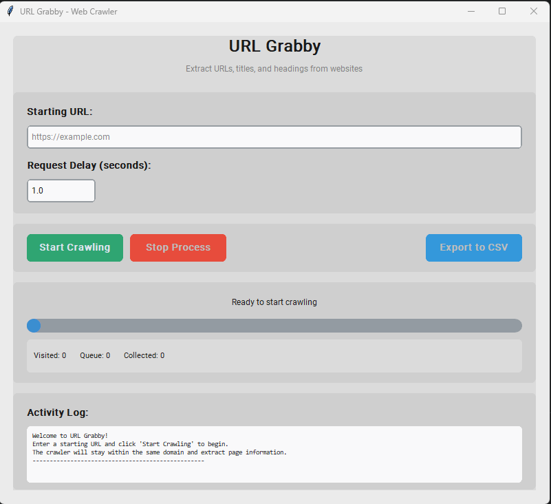

# URL Grabby

A desktop application that crawls websites within the same domain and extracts page information including URLs, titles, and main headings. The collected data is saved to a CSV file for further analysis.

## Features

- 🌐 **Domain-specific crawling**: Stays within the same domain as the starting URL
- 📊 **Data extraction**: Collects page URLs, titles (`<title>`), and main headings (`<h1>`)
- 💾 **CSV export**: Saves collected data in a structured CSV format
- 🎯 **Real-time monitoring**: Live progress tracking and status updates
- ⚡ **Threaded processing**: Non-blocking GUI with responsive interface
- ⏸️ **Stop control**: Ability to halt the crawling process at any time
- 🔧 **Configurable delays**: Adjustable request intervals to be respectful to target servers

## Screenshots



## Installation

### Prerequisites

- Python 3.7 or higher
- pip (Python package installer)

### Setup

1. **Clone the repository**:
   ```bash
   git clone https://github.com/yourusername/url-grabby.git
   cd url-grabby
   ```

2. **Create a virtual environment** (recommended):
   ```bash
   python -m venv venv
   
   # On Windows
   venv\Scripts\activate
   
   # On macOS/Linux
   source venv/bin/activate
   ```

3. **Install dependencies**:
   ```bash
   pip install -r requirements.txt
   ```

## Usage

1. **Run the application**:
   ```bash
   python main.py
   ```

2. **Enter a starting URL**: Input the URL you want to begin crawling from

3. **Set request delay**: Configure the delay between requests (in seconds) to be respectful to the target server

4. **Start crawling**: Click "Start Crawling" to begin the process

5. **Monitor progress**: Watch the real-time log and progress bar

6. **Save results**: When complete, choose where to save your CSV file

## How It Works

URL Grabby works by:

1. Starting with a user-provided URL
2. Extracting all links from each page
3. Following only links within the same domain
4. Collecting page title and main heading information
5. Maintaining a queue of URLs to visit and tracking visited URLs
6. Saving all collected data to a CSV file

## Data Output

The application generates a CSV file with the following columns:

- **URL**: The complete URL of the page
- **Page Title**: Content of the `<title>` tag
- **Main Heading**: Content of the first `<h1>` tag found

## Configuration

### Request Delays

Set appropriate delays between requests to:
- Avoid overwhelming the target server
- Respect robots.txt guidelines
- Prevent being blocked by rate limiting

### Domain Restrictions

The crawler automatically:
- Stays within the same domain as the starting URL
- Converts relative URLs to absolute URLs
- Ignores external links and subdomains

## Technical Details

### Built With

- **Python 3**: Core programming language
- **customtkinter**: Modern GUI framework
- **requests**: HTTP library for web requests
- **BeautifulSoup4**: HTML parsing and data extraction
- **threading**: Concurrent processing for responsive UI

### Architecture

- **Threaded Design**: Crawling runs in a separate thread to keep the GUI responsive
- **Queue Management**: Uses sets for efficient URL tracking and deduplication
- **Error Handling**: Robust error handling for network issues and malformed HTML
- **Memory Efficient**: Processes pages one at a time without storing large amounts of data in memory

## Contributing

1. Fork the repository
2. Create a feature branch (`git checkout -b feature/amazing-feature`)
3. Commit your changes (`git commit -m 'Add some amazing feature'`)
4. Push to the branch (`git push origin feature/amazing-feature`)
5. Open a Pull Request

## License

This project is licensed under the MIT License - see the [LICENSE](LICENSE) file for details.

## Disclaimer

Please use this tool responsibly:

- Respect website terms of service
- Follow robots.txt guidelines
- Use appropriate delays between requests
- Don't overload servers with excessive requests
- Be mindful of copyright and data usage policies

## Support

If you encounter any issues or have questions:

1. Check the [Issues](https://github.com/yourusername/url-grabby/issues) page
2. Create a new issue with detailed information
3. Include error messages and steps to reproduce

## Roadmap

- [ ] Support for custom selectors
- [ ] Export to multiple formats (JSON, Excel)
- [ ] Advanced filtering options
- [ ] Scheduled crawling
- [ ] Web interface version
- [ ] Docker containerization

---


**Happy Crawling!** 🕷️

Made with ❤️ by rusli3
